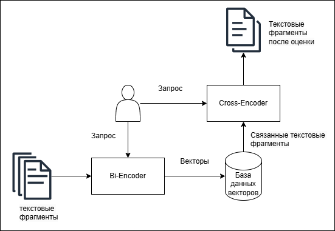

Setup:
1. cd backend
2. uv venv
3. .venv\Scripts\activate
4. uv pip install -r requirements.txt
5. npm insntall

A. Run Chroma: 
    1. cd backend;
    2. chroma run --host localhost --port 8000 --path ./my_chroma_data

B. Run uvicorn:
    1. cd backend;
    2. uvicorn main:app --host localhost --port 8080

C. Run Ollama: ollama serve, ollama run bambucha/saiga-llama3

D. Run ReactJs with vite on port 5173(default):
(Visit [link](https://www.geeksforgeeks.org/reactjs/how-to-setup-reactjs-with-vite/) for details)
    1. cd frontend;
    2. npm run dev

Diagrams:

